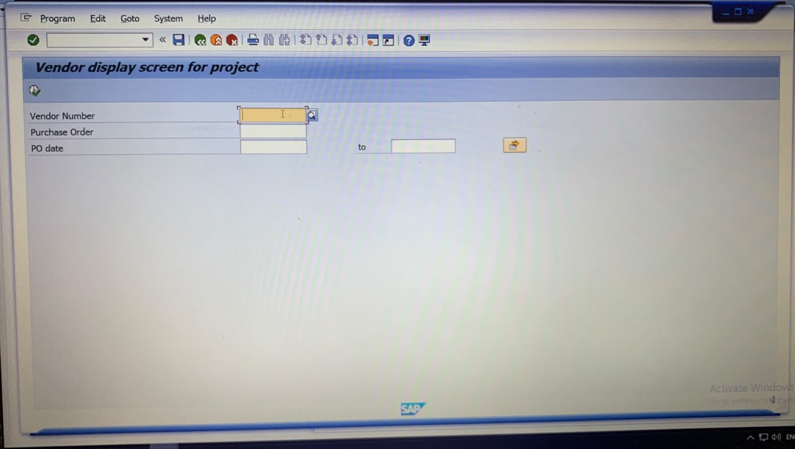
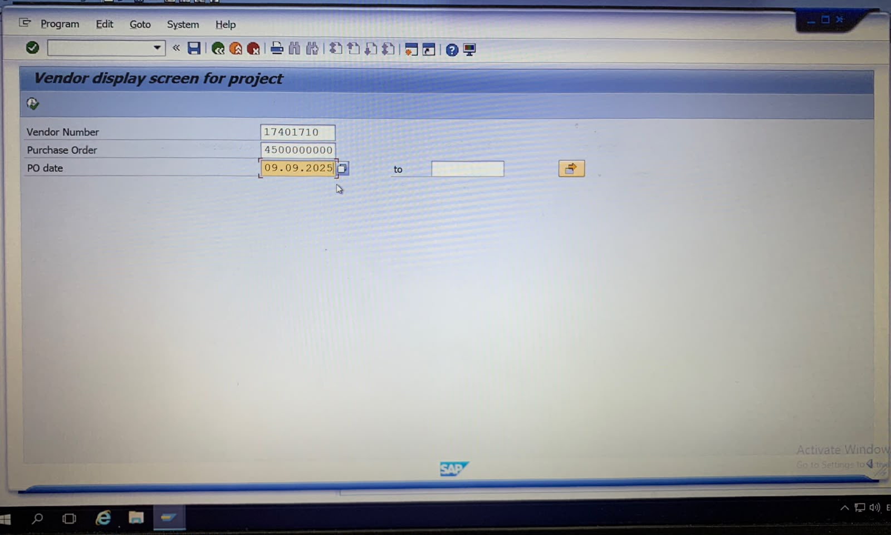
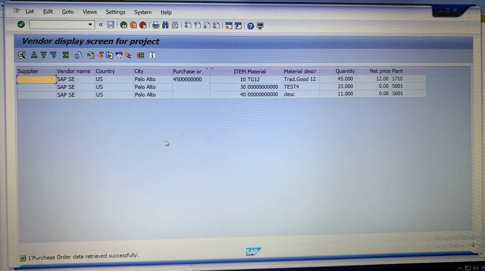
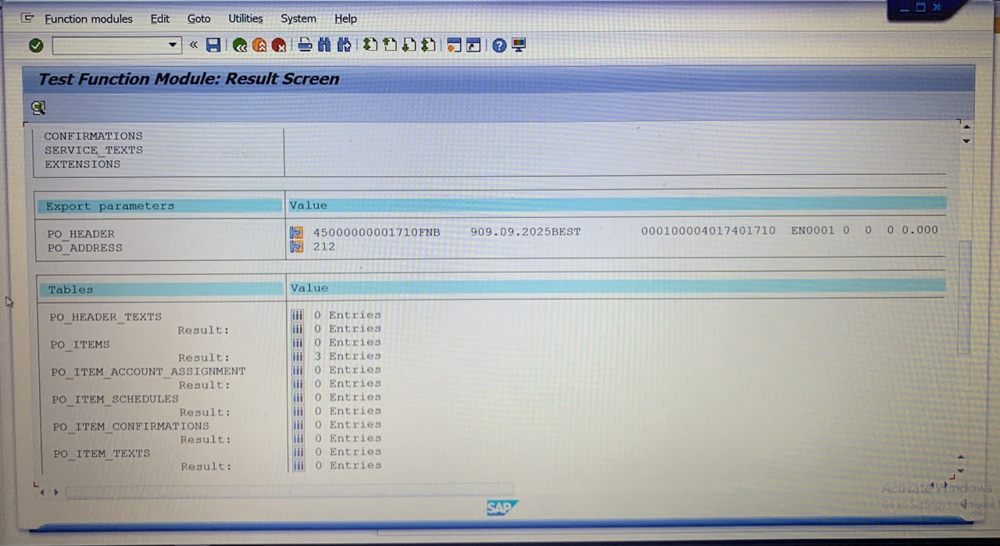

# SAP ABAP Purchase Order Management

## Project Overview

An end-to-end SAP ABAP project for vendor and purchase order management using standard SAP MM tables, Object-Oriented ABAP, ALV and BAPI.

## Features

- Vendor details retrieval from LFA1
- Purchase order retrieval from EKKO
- Purchase order item retrieval from EKPO
- Material description retrieval from MAKT
- Custom transparent table for project data storage
- Global ABAP class with multiple methods
- DDIC table types for internal table handling
- ALV Grid display with field catalog and sorting
- BAPI_PO_GETDETAIL integration
- Selection screen with vendor, purchase order and date filters
- No-data handling and success messages

## SAP Objects

| Object | Name |
|---|---|
| Report | ZVENDORPROJECT_DISPLAY |
| Global Class | ZCL_VENDOR_PROJECT |
| Custom Table | ZVENDORPROJECT |
| EKKO Table Type | ZTT_EKKO |
| EKPO Table Type | ZTT_EKPO |
| BAPI Table Type | ZTT_BAPI_PO_ITEMS |

## Standard SAP Tables

- LFA1 – Vendor Master
- EKKO – Purchase Order Header
- EKPO – Purchase Order Items
- MAKT – Material Description

## Technologies & Concepts

- SAP ABAP
- Open SQL
- Object-Oriented ABAP
- Internal Tables
- DDIC
- ALV Grid
- BAPI
- SAP MM

## Project Flow

Selection Screen → Vendor Details → Purchase Orders → Purchase Order Items → Material Description → Custom Table → ALV Output

## Screenshots

### Selection Screen

### Selection Screen Input

### ALV Output

### BAPI Test

